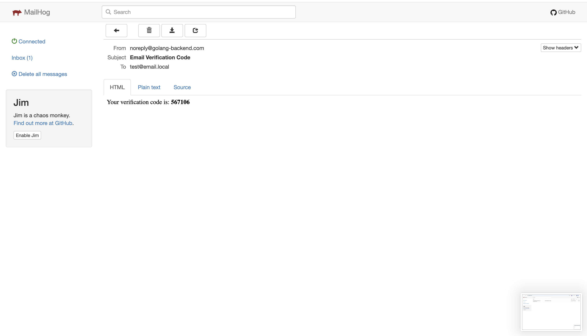

# Panduan Pengembangan (Development Guide)

Dokumen ini menjelaskan standar dan pola yang digunakan dalam proyek ini, termasuk cara membuat fitur baru, pagination, dan sistem kebijakan (policy).

---

## 1. Menambahkan Model Baru (CRUD Lengkap)

Ikuti langkah-langkah ini saat ingin menambahkan fitur atau entitas baru (misalnya: `Product`).

### Langkah 1: Buat Entity (Model Database)
Buat file di folder `entity/product.go`. Pastikan menggunakan `Base` struct untuk ID (ULID) dan timestamps otomatis.

```go
package entity

type Product struct {
    Base // ID, CreatedAt, UpdatedAt, DeletedAt
    Name        string  `gorm:"type:varchar(255);not null"`
    Description string  `gorm:"type:text"`
    Price       float64 `gorm:"not null"`
    Stock       int     `gorm:"default:0"`
}
```

### Langkah 1.5: Buat DTO (Request/Response)
Buat file `dto/product_dto.go` untuk mendefinisikan struktur data yang masuk (Request) dan keluar (Response) API. Pisahkan dari Entity database.

```go
package dto

type CreateProductRequest struct {
    Name        string  `json:"name" binding:"required"`
    Description string  `json:"description"`
    Price       float64 `json:"price" binding:"required,gt=0"`
    Stock       int     `json:"stock" binding:"required,gte=0"`
}

type ProductResponse struct {
    ID          string  `json:"id"`
    Name        string  `json:"name"`
    Price       float64 `json:"price"`
    Stock       int     `json:"stock"`
}
```

### Langkah 2: Buat Repository (Akses Data)
Buat file `repository/product_repository.go`. Gunakan interface dan implementasi struct.

**Penting:** Tambahkan metode `Paginate` untuk mendukung fitur pencarian dan paginasi standar.

```go
package repository

import (
    "golang-backend/entity"
    "golang-backend/utils"
    "gorm.io/gorm"
)

type ProductRepository interface {
    Paginate(filters map[string]interface{}, page int, perPage int) (*utils.PaginationResult, error)
    // Metode lain: Create, FindByID, Update, Delete...
}

type productRepository struct {
    db *gorm.DB
}

func NewProductRepository(db *gorm.DB) ProductRepository {
    return &productRepository{db}
}

func (r *productRepository) Paginate(filters map[string]interface{}, page int, perPage int) (*utils.PaginationResult, error) {
    var products []entity.Product
    var total int64
    query := r.db.Model(&entity.Product{})

    // Implementasi Pencarian (Smart Search)
    if search, ok := filters["search"].(string); ok && search != "" {
        // Postres Full Text atau LIKE biasa
        searchTerm := "%" + search + "%"
        query.Where("name ILIKE ? OR description ILIKE ?", searchTerm, searchTerm)
    }

    // Hitung total data sebelum limit
    query.Count(&total)

    // Paginasi
    offset := (page - 1) * perPage
    err := query.Limit(perPage).Offset(offset).Find(&products).Error
    
    // Hitung Meta Paginasi
    pagination := utils.CalculatePagination(total, page, perPage)

    return &utils.PaginationResult{
        Items:      products,
        Pagination: pagination,
    }, err
}
```

### Langkah 3: Buat Service (Logika Bisnis)
Buat `service/product_service.go` yang memanggil repository.

```go
type ProductService interface {
    GetProducts(filters map[string]interface{}, page, perPage int) (*utils.PaginationResult, error)
}
// Implementasi mirip dengan repository, hanya passing data
```

### Langkah 4: Buat Controller (Handler API)
Buat `controller/product_controller.go`. Gunakan `utils.PaginatedResponse` untuk format standar.

```go
func (c *ProductController) GetProducts(ctx *gin.Context) {
    // 1. Cek Policy (Izin Akses)
    if err := middleware.AuthorizeRead(ctx, "product"); err != nil {
        utils.ErrorResponse(ctx, err.Error(), http.StatusForbidden, nil)
        return
    }

    // 2. Ambil Parameter Paginasi
    page, perPage := utils.GetPaginationParams(ctx)

    // 3. Filter dari Query Params
    filters := map[string]interface{}{
        "search": ctx.Query("search"),
    }

    // 4. Panggil Service
    result, err := c.service.GetProducts(filters, page, perPage)
    if err != nil {
        utils.ErrorResponse(ctx, err.Error(), http.StatusInternalServerError, nil)
        return
    }

    // 5. Return Respons Terstandar
    utils.PaginatedResponse(ctx, "Products retrieved", result.Items, utils.BuildMeta(result.Pagination, "10ms")) // Durasi bisa dihitung real
}
```

### Langkah 5: Daftarkan Route
Edit `routes/routes.go` dan tambahkan route baru di dalam grup `protected`.

```go
protected.GET("/products", productCtrl.GetProducts)
```

---

## 2. Sistem Kebijakan (Policy & Permissions)

Sistem ini mirip dengan Policy di framework lain (seperti Laravel). Izin dicek `middleware/policy.go`.

### Cara Menggunakan di Controller:

Gunakan fungsi helper `Authorize...` di awal handler controller Anda.

*   `AuthorizeRead(ctx, "user")`: Cek apakah user punya izin melihat user (`view_user` atau `manage_users`).
*   `AuthorizeCreate(ctx, "product")`: Cek izin `create_product`.
*   `AuthorizeEdit(ctx, "product")`: Cek izin `edit_product`.
*   `AuthorizeDelete(ctx, "product")`: Cek izin `delete_product`.

Contoh:
```go
if err := middleware.AuthorizeCreate(ctx, "product"); err != nil {
    return // Error 403 Forbidden
}
```

### Setup Izin Baru:
Jika membuat modul baru (misal `Product`), pastikan menambahkan permission terkait di `utils/seed.go` agar masuk ke database:
*   `view_product`
*   `create_product`
*   `edit_product`
*   `delete_product`
*   `manage_products` (Admin super)

---

## 3. Paginasi & Respons API

Kami menggunakan format respons standar JSON.

### Format Sukses:
```json
{
  "success": true,
  "message": "Data retrieved",
  "data": [ ... ],
  "meta": {
    "current_page": 1,
    "per_page": 15,
    "total": 100,
    "last_page": 7,
    "has_more_pages": true
  }
}
```

### Helper Penting (`utils/`):

*   `GetPaginationParams(ctx)`: Mengambil `page` dan `per_page` dari URL query. Otomatis default ke 1 dan 15.
*   `CalculatePagination(total, page, perPage)`: Mengembalikan struct `Pagination` lengkap.
*   `PaginatedResponse(ctx, msg, data, meta)`: Mengirim respons JSON dengan format di atas.

---

## 4. Pencarian Cerdas (Smart Search)

Di Repository, implementasinya mendukung dua mode:
1.  **Full Text Search (Postgres)**: Untuk kata kunci panjang (>3 karakter) dan kompleks. Menggunakan `to_tsvector`.
2.  **LIKE Search**: Fallback untuk kata kunci pendek atau sederhana.

Contoh implementasi ada di `repository/user_repository.go`.

---

## 5. Logging & Debugging

Kami menggunakan **Structured Logging (JSON)** agar log mudah dibaca mesin (Kibana/Logstash) dan **Log Rotation** agar disk tidak penuh.

### Cara Logging (Structured):
Gunakan library standar `log/slog` (Go 1.21+).

```go
import "log/slog"

// Info biasa
slog.Info("User logged in", "email", user.Email)

// Error dengan detail
slog.Error("Failed to upload image", "error", err.Error(), "user_id", userID)
```

### Lokasi Log:
Log tersimpan di dua tempat:
1. **Terminal (Console)**: Untuk development.
2. **File (`logs/server.log`)**: Untuk production/history.

### Rotasi Log (Log Rotation):
File log otomatis dirotasi oleh library `lumberjack` dengan aturan:
*   **Max Size**: 10 MB (File baru dibuat jika > 10MB)
*   **Max Backups**: 5 File
*   **Max Age**: 30 Hari
*   **Kompresi**: `.gz` (File lama dikompres otomatis)
---

## 6. Migrasi Database (GORM AutoMigrate)

Proyek ini menggunakan fitur `AutoMigrate` dari GORM untuk sinkronisasi skema database. Migrasi dikelola di dalam folder `migrations/`.

### Cara Menambah Tabel Baru:
1.  **Buat Entity**: Tambahkan struct di folder `entity/` (misal: `Product`).
2.  **Daftarkan di Migrations**: Buka `migrations/migrate.go` atau buat file baru di `migrations/` jika memerlukan logika SQL manual (seperti Full-Text Search index).
3.  **Panggil Fungsi**: Pastikan fungsi migrasi dipanggil di dalam `RunMigrations`.

Contoh menambah index manual di `migrations/product.go`:
```go
func migrateProducts(db *gorm.DB) {
    db.AutoMigrate(&entity.Product{})
    // Contoh add index manual jika dibutuhkan
    db.Exec("CREATE INDEX IF NOT EXISTS idx_products_name ON products(name)")
}
```

### Eksekusi:
Jalankan di terminal:
```bash
make db-migrate
```

---

## 7. Database Seeding (Data Awal)

Seeder digunakan untuk mengisi data default aplikasi (Super Admin, Master Roles, dll). Logika seeder berada di `utils/seed.go`.

### Alur Seeder:
1.  **SeedRolesAndPermissions**: Membuat daftar role (`admin`, `user`) dan permission.
2.  **SeedUsers**: Membuat akun Super Admin default dan beberapa user dummy untuk testing.

### Menambah Data Baru:
Buka `utils/seed.go` dan tambahkan logika menggunakan `db.FirstOrCreate` agar tidak terjadi duplikasi saat seeder dijalankan berulang kali.

### Eksekusi:
Jalankan di terminal:
```bash
make db-seed
```

> **Catatan**: Selalu jalankan `make db-migrate` terlebih dahulu sebelum `make db-seed` untuk memastikan struktur tabel sudah siap.

---

## 8. Email Testing (MailHog)



Untuk mencobanya fitur pengiriman email di local (tanpa spamming email asli), gunakan **MailHog**.

### Opsi 1: Menggunakan Docker (Recommended)
Jika Docker Desktop sudah terinstall, cukup jalankan:
```bash
docker run -d -p 1025:1025 -p 8025:8025 mailhog/mailhog
```

### Opsi 2: Manual (Mac/Homebrew)
```bash
brew install mailhog
mailhog
```

### Opsi 3: Manual (Windows)
1.  Download file `.exe` dari [GitHub Releases](https://github.com/mailhog/MailHog/releases).
2.  Simpan di folder project dan jalankan via CMD/PowerShell:
```bash
./MailHog_windows_amd64.exe
```

### Konfigurasi .env
Seting agar aplikasi mengirim email ke port MailHog:
```env
SMTP_HOST=localhost
SMTP_PORT=1025
SMTP_USER=test
SMTP_PASSWORD=test
```

### Cara Cek Email
Buka browser: [http://localhost:8025](http://localhost:8025)
