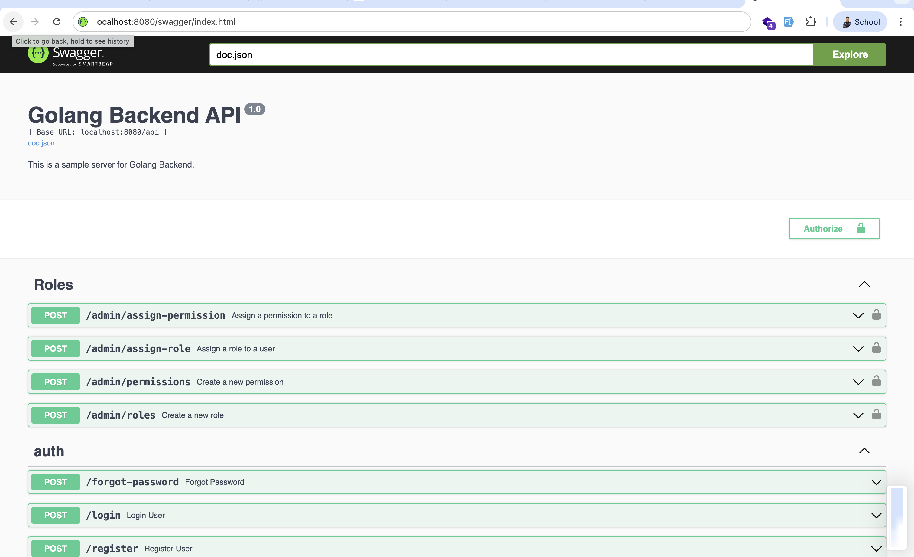
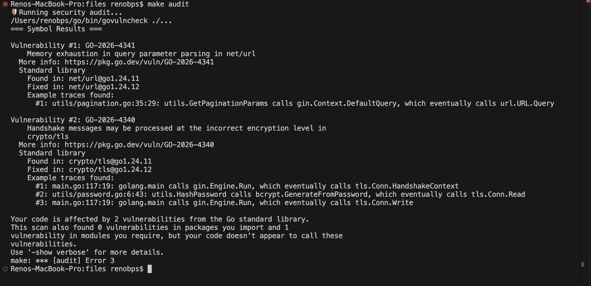

# 🚀 Golang Backend Starter Kit


[](https://go.dev/)
[](https://gin-gonic.com/)
[](https://gorm.io/)
[](LICENSE)

**Starter Kit** Backend REST API yang tangguh, bersih, dan modular. Dibangun dengan fokus pada keamanan, performa, dan skalabilitas menggunakan **Go**, **Gin**, dan **GORM**.

Proyek ini dirancang untuk menjadi fondasi *production-ready* bagi aplikasi modern, lengkap dengan fitur krusial yang sudah terintegrasi secara *out-of-the-box*.

---

## ✨ Fitur Utama

| Fitur | Deskripsi |
| :--- | :--- |
| **🆔 ULID** | Menggunakan *Universally Unique Lexicographical Sortable Identifier* untuk ID yang unik dan terurut secara kronologis. |
| **🔐 Auth & RBAC** | Otentikasi JWT dengan Full Role-Based Access Control (RBAC) dan Policy-based Authorization. |
| **🛡️ Security** | Terintegrasi dengan Rate Limiting (per IP & User), CORS, `bcrypt` hashing, dan audit keamanan otomatis. |
| **📧 Email System** | Alur verifikasi email dan reset password (Lupa Kata Sandi) yang siap pakai via SMTP. |
| **📊 Smart Search** | Paginasi cerdas dengan Full-Text Search dan pemfilteran otomatis pada semua endpoint list. |
| **📝 Logging** | Logging terstruktur (JSON) dengan rotasi otomatis, siap untuk integrasi ELK Stack. |
| **📖 Swagger** | Dokumentasi API interaktif yang otomatis dibuat dari dekorator kode. |
| **🛠️ Dev Experience** | Hot reload menggunakan `air`, Makefile untuk otomatisasi tugas, dan migrasi DB otomatis. |

---

## 🛠️ Tech Stack

- **Languange:** [Go](https://go.dev/) (v1.25+)
- **Web Framework:** [Gin Web Framework](https://gin-gonic.com/)
- **ORM:** [GORM](https://gorm.io/)
- **Database:** [PostgreSQL](https://www.postgresql.org/)
- **IDs:** [ULID](https://github.com/oklog/ulid)
- **Email:** [Gomail.v2](https://github.com/go-gomail/gomail)
- **Docs:** [Swagger (swag)](https://github.com/swaggo/swag)

---

## 📂 Struktur Proyek

```bash
.
├── config/         # Konfigurasi aplikasi & database
├── controller/     # Layer Handler (API Entry Points)
├── docs/           # Dokumentasi Swagger & Aset
├── dto/            # Data Transfer Objects (Payloads & Responses)
├── entity/         # Model Database & Base Entity (ULID inside)
├── middleware/     # Auth, Logger, RateLimiter, CORS, Policy
├── migrations/     # Handler Migrasi Database
├── repository/     # Layer Akses Data (Database Queries)
├── routes/         # Definisi Rute API
├── service/        # Business Logic Layer
├── utils/          # Helper (JWT, Email, Response, Pagination)
├── logs/           # Log file (JSON Structured)
└── main.go         # Terminal utama aplikasi
```

---

## ⚡ Memulai Cepat (Quick Start)

### 📋 Prasyarat
- **Go 1.25+** (Disarankan demi keamanan maksimal)
- **PostgreSQL**
- **Air** (untuk hot reload: `go install github.com/cosmtrek/air@latest`)

### ⚙️ Instalasi

1. **Clone Repositori:**
   ```bash
   git clone https://github.com/zanwaar/Golang-Backend-StarterKit.git
   cd Golang-Backend-StarterKit
   ```

2. **Setup Environtment:**
   ```bash
   cp .env.example .env # Sesuaikan konfigurasi di file .env
   ```

3. **Install Dependensi:**
   ```bash
   make deps
   ```

### 🏃 Menjalankan Aplikasi

```bash
# 1. Jalankan Migrasi Database
make db-migrate

# 2. Isi Data Awal (Super Admin & Dummy)
make db-seed

# 3. Jalankan di Mode Pengembangan (Hot Reload)
make dev
```

> **Default Super Admin:** `superadmin@example.com` / `password`

---

## 📖 Dokumentasi API

Kelola dan uji API secara interaktif melalui Swagger UI. Setelah aplikasi berjalan, akses:

👉 [http://localhost:8080/swagger/index.html](http://localhost:8080/swagger/index.html)


---

## 🛡️ Keamanan & Kualitas

Kami mengutamakan keamanan dan kualitas kode dengan alat bantu otomatis:

- **Audit Keamanan:** `make audit` untuk memeriksa kerentanan dependensi menggunakan `govulncheck`.
- **Linting:** `make lint` untuk memastikan standar penulisan kode Go.
- **Testing:** `make test` untuk menjalankan seluruh unit test dengan *race detection*.

### 🔍 Mengenal `make audit`
Perintah ini sangat penting untuk menjaga aplikasi tetap aman. Ia akan memindai seluruh *database* kerentanan Go yang diketahui dan mencocokkannya dengan kode Anda.



**Apa yang harus dilakukan jika ditemukan kerentanan (Vulnerability)?**
Jika hasil audit menunjukkan adanya masalah (berwarna merah), jangan panik! Ikuti langkah berikut:
1. **Identifikasi Vulnerability:** Lihat ID yang diawali dengan `GO-20XX-XXXX`.
2. **Update Versi:** Coba jalankan `go get -u ./...` dan `go mod tidy` untuk memperbarui dependensi ke versi terbaru yang sudah menambal celah tersebut.
3. **Cari Solusi:** Cari ID vulnerability tersebut di forum komunitas atau Google.
4. **Tanya AI:** Anda bisa menyalin detail log audit tersebut dan menanyakannya ke Chat AI (seperti ChatGPT atau Claude) untuk mendapatkan langkah perbaikan teknis yang lebih mendalam.

---

## 🔗 Panduan Lanjutan

- 📘 **[Panduan Pengembangan](./GUIDE_PENGEMBANGAN.md)**: Cara menambah fitur, model, dan aturan bisnis baru.
- � **[Optimasi Database](./GUIDE_OPTIMASI_DATABASE.md)**: Panduan indexing dan performa query.

---

## 🤝 Kontribusi

Kontribusi selalu diterima! Rasakan kebebasan untuk membuka *issue* atau mengirimkan *pull request*.

1. Fork Proyek
2. Buat Feature Branch (`git checkout -b feature/FiturKeren`)
3. Commit Perubahan (`git commit -m 'Add FiturKeren'`)
4. Push ke Branch (`git push origin feature/FiturKeren`)
5. Buka Pull Request

---

Developed with ❤️ by [zanwaar](https://github.com/zanwaar)
